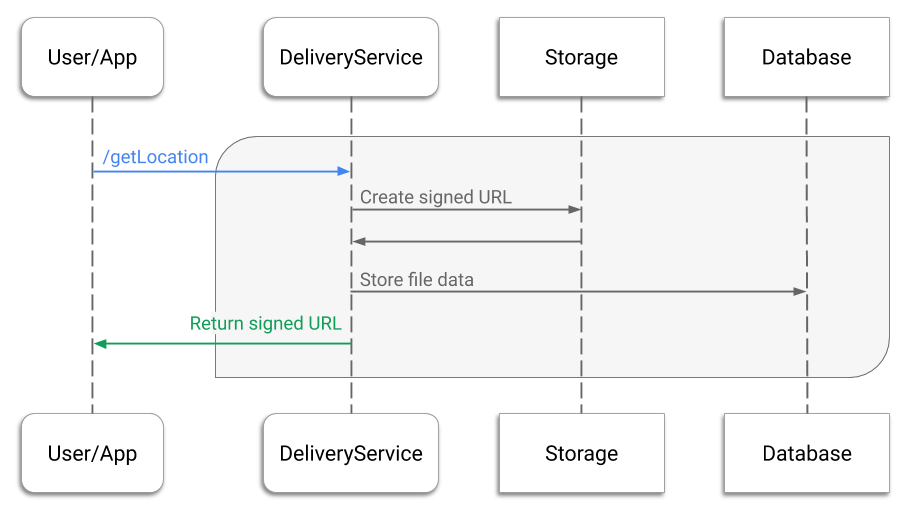
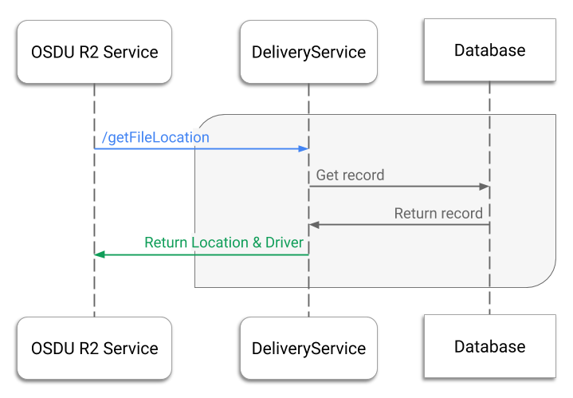

# OSDU R2 Prototype File service

## Contents

[[_TOC_]]

## Introduction

The OSDU R2 File service provides internal and external API endpoints to let the application or
user fetch any records from the system or request file location data.  For example, users can
request generation of an individual signed URL per file. Using a signed URL, OSDU R2 users will be
able to upload their files to the system.

The current implementation of the File service supports only cloud platform-specific locations.
The future implementations might allow the use of on-premises locations.

## System interactions

The File service defines the following workflows:

* File upload
* File location
* File list

### File upload

The file upload workflow is defined for the `/v2/getLocation` API endpoint. The following diagram
illustrates the workflow.



Upon a request to get a location for a file:

1. Verify the incoming request.
    * Verify the authentication token. Fail signed URL generation if the token is missing or
    invalid, and then respond with the `401 Unauthorized` status.
    * Verify the partition ID. Fail signed URL generation if the partition ID is missing, invalid or
    doesn't have assigned user groups, and then respond with the `400 Bad Request` status.
    * Verify the file ID if it's passed in the request body. Fail signed URL generation if the file
    ID is invalid or if this ID has already been created. Respond with `400 Bad Request` status
    and the `Location for fileID {ID} already exists` message.
2. Generate a new Universally Unique Identifier (UUID) for the file if a file ID wasn't provided.
3. Create an empty object in storage, and then generate a signed URL with the write access for that
object. By the signed URL, the user or application will upload their file for ingestion. The
generated signed URL has a maximum duration of 7 days.
    * By the signed URL, the user or application will upload their file.
    * The generated signed URL has the maximum duration of 7 days.
    > How signed URLs are generated depends on the cloud platform.
4. Create a record with file data in the database. The record will contain a key-value pair with the
file ID as the key and object as the value. For more information on the record, consult the
[Firestore](#firestore-collections) section.
5. Return the signed URL and file ID to the application or user.

### File location

The file location workflow is defined for the `/v2/getFileLocation` API endpoint. The
following diagram demonstrates the workflow.



Upon request from an OSDU R2 service:

1. Validate the incoming request.
    * Verify the authentication token. Fail file location if the token is missing or
    invalid, and then respond with the `401 Unauthorized` status.
    * Verify the partition ID. Fail file location if the partition ID is missing, invalid
    or doesn't have assigned user groups, and then respond with the `400 Bad Request` status.
2. Query the database with the `FileID` to get the file record.
3. Return the `Location` and `Driver` from the file record to the calling service.

### File list

The file list workflow is defined for the `/v2/getFileList` API endpoint.

Upon request from another OSDU R2 service:

1. Verify the incoming request.
    * Verify the authentication token. Fail file list if the token is missing or invalid,
    and then respond with the `401 Unauthorized` status.
    * Verify the partition ID. Fail file list if the partition ID is missing, invalid or
    doesn't have assigned user groups, and then respond with the `400 Bad Request` status.
    * Validate the file list request.
2. Obtain the requested files from the database.
3. Return the result to the caller.

## Database interactions

During each workflow, the File service queries the database. For more information about the file
records in the database, consult the [file-locations collection](#firestore-collections) section.

## Validations

The File service's current implementation performs a general check of the validity of the
authorization token and partition ID before the service starts generation of a location.

However, the File service in the OSDU R2 Prototype doesn't perform any verification whether a
file upload happened or whether the user started ingestion after uploading a file. In future OSDU
implementations, the File service will be able to check if file uploads did happen.

## File API

The File service's API includes the following three methods in the OSDU R2 Prototype:

* `/v2/getLocation`, external
* `/v2/getFileLocation`, internal
* `/v2/getFileList`, internal

General considerations related to querying the File API:

* Each endpoint must receive the authentication bearer token in the "Authorization" header. Example:
`"Authorization": "Bearer {token}"`
* Each endpoint must receive a partition ID in header. Example:
`"Data-Partition-Id": "default-partition"`
* The request and response Content Type is **application/json**

### POST /v2/getLocation

The `/v2/getLocation` API endpoint creates a new location in the landing zone, such as a GCS bucket,
and returns it to the user so they upload a file for ingestion by that location.

#### Request body

| Property      | Type     | Description           |
| ------------- | -------- | --------------------- |
| FileID        | `String` | Unique ID of the file |

> **Note**: If a `FileID` isn't provided in the request, the File service generates a
> Universally Unique Identifier (UUID) to be stored in `FileID`. If a `FileID` is provided and is
> already registered in the system, an error is returned.

> **Note**: The `FileID` must correspond to the regular expression: `^[\w,\s-]+(\.\w+)?$`.

Request example:

```sh
curl --location --request POST 'https://{path}/v2/getLocation' \
    --header 'Authorization: Bearer {token}' \
    --header 'Content-Type: application/json' \
    --header 'Data-Partition-Id: {Data-Partition ID}' \
    --data-raw '{
        "FileID": "8900a83f-18c6-4b1d-8f38-309a208779cc"
    }'
```

#### Response

The File service returns the following data.

| Property  | Type     | Description                                           |
| --------- | -------- | ----------------------------------------------------- |
| FileID    | `String` | ID of the file to be ingested                         |
| Location  | `List`   | List of key-value pairs with cloud provider details to access the landing zone* |
| SignedURL | `String` | Signed URL by which the file to be ingested is stored |

> **Note**: The landing zone is a location in a cloud provider's platform where the user uploaded
> files for OSDU ingestion. The landing zone consists of the `Driver` and `Location` properties,
> which are stored in the database for each file upload request.

Response example:

```json
{
  "FileID": "file ID",
  "Location": {
      "SignedURL": "GCS signed URL"
  }
}
```

### POST /v2/getFileLocation

The `/v2/getFileLocation` API endpoint works similarly to `/v2/getLocation`, but is internal and returns
the landing zone &mdash; `Location` and `Driver` &mdash; of a particular file instead of a signed
URL.

Once the OSDU security model is formulated and approved, the `/v2/getFileLocation` API endpoint will
not be returning files that belong to other users.

#### Request body

| Property | Type     | Description                   |
| -------- | -------- | ----------------------------- |
| FileID   | `String` | ID of the file to be ingested |

Request example:

```sh
curl --location --request POST 'https://{path}/v2/getFileLocation' \
    --header 'Authorization: Bearer {token}' \
    --header 'Content-Type: application/json' \
    --header 'Data-Partition-Id: {assigned partition ID}' \
    --data-raw '{
        "FileID": "8900a83f-18c6-4b1d-8f38-309a208779cc"
    }'
```

#### Response

| Property | Type     | Description                                         |
| -------- | -------- | --------------------------------------------------- |
| Driver   | `String` | Description of the storage where the file is stored |
| Location | `String` | Direct URI to the file in storage                   |

### POST /v2/getFileList

The `/v2/getFileList` API endpoint allows auditing the attempted file uploads. The method is
unavailable for third-party applications.

The ingestion process depends on whether the client application uploaded a file or not. The
`/v2/getFileList` endpoint is designed to let other OSDU services to inspect which user uploaded a
file, whether the file was uploaded to the landing zone, and whether the user started ingestion
after the file upload.

#### Request

| Property | Type       | Description                                 |
| -------- | ---------- | ------------------------------------------- |
| TimeFrom | `datetime` | Timestamp                                   |
| TimeTo   | `datetime` | Time interval for the CreatedAd filter      |
| PageNum  | `integer`  | The page number to return paginated results |
| Items    | `short`    | Pagination of the result                    |
| UserID   | `String`   | The ID of the user role or group            |

> **Note**: The `UserID` property isn't supported in the OSDU R2 Prototype.

Request example:

```sh
curl --location --request POST 'https://{path}/v2/getFileList' \
    --header 'Authorization: Bearer {token}' \
    --header 'Data-Partition-Id: {assigned partition ID}' \
    --header 'Content-Type: application/json' \
    --data-raw '{
        "PageNum": 0,
        "TimeFrom": "2020-01-01T16:21:00.552Z",
        "UserID": "common-user",
        "TimeTo": "2020-02-15T16:28:44.220Z",
        "Items": 2
    }'
```

### Response

A paginated result of the records stored in the database.

| Property         | Type      | Description                                      |
| ---------------- | --------- | ------------------------------------------------ |
| Content          | `List`    | List of file records retrieved from the database |
| Number           | `integer` | Some number                                      |
| NumberOfElements | `integer` | The amount of the returned records               |
| Size             | `short`   | The size of the Content list                     |

Each file record contains the following properties: `FileID`, `Driver`, `Location`, `CreatedAt`,
`CreatedBy`. For more information the returned properties, consult the [Firestore
collections](#firestore-collections) section.

Response example:

```json
{
    "Content": [
        {
            "FileID": "30a1ace6-1c8f-4f08-9982-2e9c5df8e878",
            "Driver": "GCS",
            "Location": "gs://osdu-temporary-files/common-user/1580461525198-2020-02-12-05-23-25-198/30a1ace6-1c8f-4f08-9982-2e9c5df8e878",
            "CreatedAt": "2020-02-12T05:24:25.198+0000",
            "CreatedBy": "common-user"
        },
        {
            "FileID": "da057da3-0fdb-41e4-afdc-3b63b812d484",
            "Driver": "GCS",
            "Location": "gs://osdu-temporary-files/common-user/1580461525198-2020-02-13-12-19-14-205/da057da3-0fdb-41e4-afdc-3b63b812d484",
            "CreatedAt": "2020-02-13T12:19:14.205+0000",
            "CreatedBy": "common-user"
        }
    ],
    "Number": 0,
    "NumberOfElements": 2,
    "Size": 2
}
```

### POST /v2/files/revokeURL

The `/v2/files/revokeURL` API endpoint revokes the Signed URLs based on the request parameters.<br/>
For example:  for the given `storage account`.

- Required permissions: `service.file.admin` role required to perform revoke operation

#### Request body

| Property  | Type                 | Description                     |
|-----------|----------------------|---------------------------------|
| property1 | `Type of Property-1` | Required Property to Revoke URL |
| propertyN | `Type of Property-N` | Required Property to Revoke URL |

> **Note**:
>- The Request is a Map of Properties to manage the input parameters required to revoke Signed URLs.
>- Each CSP will have its own implementation and request properties based on the revoke Logic supported by the provider.
>- Example: For `Azure` [ Resource Group and Storage Account Name] is required to revoke URLs. Refer [Azure README](./provider/file-azure/README.md)

Request example:

```sh
curl --location --request POST 'https://{path}/v2/files/revokeURL' \
     --header 'Authorization: Bearer {token}' \
     --header 'Content-Type: application/json' \
     --data-raw '{
        "property1": "property-1 sample value",
        "propertyN" : "property-N sample value"
     }'
```

#### Response
The File service returns the following `HTTP 204 No Content` for successful response.

## Service Provider Interfaces

The File service has several Service Provider Interfaces that the classes need to implement.

| Interface              | Required/Optional       | Path                                                                     |
| ---------------------- | ----------------------- | ------------------------------------------------------------------------ |
| AuthenticationService  | Optional to implement   | `file-core/src/main/java/.../provider/interfaces/AuthenticationService`  |
| FileListService        | Optional to implement   | `file-core/src/main/java/.../provider/interfaces/FileListService`        |
| FileLocationRepository | Optional to implement   | `file-core/src/main/java/.../provider/interfaces/FileLocationRepository` |
| FileService            | Optional to implement   | `file-core/src/main/java/.../provider/interfaces/FileService`            |
| LocationMapper         | Obligatory to implement | `file-core/src/main/java/.../provider/interfaces/LocationMapper`         |
| LocationService        | Optional to implement   | `file-core/src/main/java/.../provider/interfaces/LocationService`        |
| StorageRepository      | Obligatory to implement | `file-core/src/main/java/.../provider/interfaces/StorageRepository`      |
| StorageService         | Obligatory to implement | `file-core/src/main/java/.../provider/interfaces/StorageService`         |
| ValidationService      | Optional to implement   | `file-core/src/main/java/.../provider/interfaces/ValidationService`      |

## Running integration tests

Integration tests are located in a separate project for each cloud in the ```testing``` directory under the project root directory.

## Open API 3.0 - Swagger
- Swagger UI : https://host/context-path/swagger (will redirect to https://host/context-path/swagger-ui/index.html)
- api-docs (JSON) : https://host/context-path/api-docs
- api-docs (YAML) : https://host/context-path/api-docs.yaml

All the Swagger and OpenAPI related common properties are managed here [swagger.properties](./file-core/src/main/resources/swagger.properties)

#### Server Url(full path vs relative path) configuration
- `api.server.fullUrl.enabled=true` It will generate full server url in the OpenAPI swagger
- `api.server.fullUrl.enabled=false` It will generate only the contextPath only
- default value is false (Currently only in Azure it is enabled)
[Reference]:(https://springdoc.org/faq.html#_how_is_server_url_generated) 

## Google Cloud Implementation

* All documentation for The Cloud Datastore implementation of File service is located [here](./provider/file-gc-datastore/README.md).
