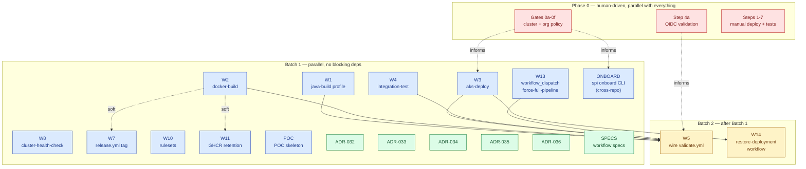

# OSDU SPI CI/CD: Implementation Plan & Sub-Issue Catalog

**Status:** Active
**Companion to:** [`cicd-build-deploy-test-design.md`](./cicd-build-deploy-test-design.md)
**Live epic (this fork):** [#1](https://github.com/danielscholl-osdu/osdu-spi/issues/1)

---

## Purpose

This document is the **canonical work breakdown** for the CI/CD pipeline epic. It serves three audiences:

1. **Humans orchestrating the rollout** — track which slots are in flight, which are blocked, what's next.
2. **Coding agents** assigned to a single sub-issue — understand context, see where your slice fits, find the design-doc references your task points at.
3. **Forkers** rebuilding this repo from scratch — regenerate the 17 GitHub issues with one script run.

## How to use this document

> [!IMPORTANT]
> **If you are an agent assigned to a single sub-issue:** read **only** the section for your assigned slot plus the design-doc sections it references. Do not implement anything else in this catalog unless you have been explicitly assigned the corresponding GitHub issue.

> [!NOTE]
> **Drift policy.** GitHub issues are the live progress tracker. This catalog is the authoritative spec. If they disagree on *what* a sub-issue should do, the catalog wins (regenerate the issue from this doc). If they disagree on *whether the sub-issue is done*, the GitHub issue wins (that's its job).

## Identifier convention

Each sub-issue has a **slot ID** (`W1`, `W7`, `ADR-032`, `POC`, `ONBOARD`, `SPECS`) that is stable across regenerations, and a **live issue number** (`#2`, `#3`, …) that changes when the issues are recreated on a fresh fork. References in this doc use slot IDs; the live mapping appears in the [Live mapping](#live-mapping) section below.

## Effort sizing

Each sub-issue carries a T-shirt size describing **effort scale**, not wall-clock time. Real elapsed time depends on agent runtime, review cycles, and how many revisions a task needs.

| Size | Meaning |
|------|---------|
| **XS** | Trivial. Single setting, one-line change, or new file from a near-complete sketch. |
| **S**  | Small. One file or one focused composite; well-scoped; minimal review surface. |
| **M**  | Medium. Multiple interconnected files; multi-step component; cross-cutting concerns within one subsystem. |
| **L**  | Large. Significant new logic; spans multiple subsystems or integrates several services. |
| **XL** | Extra large. Major undertaking; would normally be broken down further before assignment. |

> Sizes are not budgets. An XS issue can take an afternoon if review finds a subtle bug; an M issue can land in an hour if the design sketch was perfect. They're for **wave planning** (don't fan out 10 L's to agents at once) and **review prioritization**, not delivery commitments.

---

## Dependency map



## Wave strategy

Spawn agents in waves to avoid review overload. Each wave is fully parallel internally.

| Wave | Slots | Why this order |
|------|-------|----------------|
| **A — ground the design** | `ADR-032`, `ADR-033`, `ADR-034`, `ADR-035`, `ADR-036`, `POC` | Docs-only; reviewers reading these understand decisions before judging the code waves |
| **B — composite actions** | `W1`, `W2`, `W3`, `W4`, `W8` | The substantive code; review for design adherence |
| **C — plumbing + specs** | `W7`, `W10`, `W11`, `W13`, `SPECS` | Lighter scope; runs parallel with Wave B. `W13` and `W5` both touch `validate.yml` — `W13` lands first so `W5` can reference its `workflow_dispatch` input |
| **D — cross-repo** | `ONBOARD` | Different repo (`osdu-spi-stack`); no contention with anything else |
| **Final — wire it together** | `W5`, `W14` | `W5` blocked by Wave B (`W1`, `W2`, `W3`, `W4`) and `W13`. `W14` blocked by `W3` (consumes `aks-deploy`). |

**Phase 0 runs in parallel with all waves**, human-driven. Gate findings may trigger small revisions to Wave B (e.g., Gate 0b might flip `W3`'s RoleBinding form). Plan for that — it's normal, not a setback.

## Live mapping

The 19 sub-issues as currently filed on this fork (`danielscholl-osdu/osdu-spi`):

| Slot | Issue | Effort | Title |
|------|-------|--------|-------|
| `W1` | [#2](https://github.com/danielscholl-osdu/osdu-spi/issues/2) | XS | W1: Add maven_profile input to java-build action |
| `W2` | [#3](https://github.com/danielscholl-osdu/osdu-spi/issues/3) | M | W2: New docker-build composite action |
| `W3` | [#4](https://github.com/danielscholl-osdu/osdu-spi/issues/4) | M | W3: New aks-deploy composite action |
| `W4` | [#5](https://github.com/danielscholl-osdu/osdu-spi/issues/5) | M | W4: New integration-test composite action |
| `W5` | [#6](https://github.com/danielscholl-osdu/osdu-spi/issues/6) | S | W5: Wire new jobs into validate.yml |
| `W7` | [#7](https://github.com/danielscholl-osdu/osdu-spi/issues/7) | XS | W7: Add release-version image tag to release.yml |
| `W10` | [#8](https://github.com/danielscholl-osdu/osdu-spi/issues/8) | XS | W10: Update branch-protection ruleset for new required checks |
| `W11` | [#9](https://github.com/danielscholl-osdu/osdu-spi/issues/9) | S | W11: GHCR retention scheduled workflow |
| `W8` | [#10](https://github.com/danielscholl-osdu/osdu-spi/issues/10) | S | W8: New cluster-health-check composite action |
| `POC` | [#11](https://github.com/danielscholl-osdu/osdu-spi/issues/11) | XS | Create POC notes skeleton (cicd-poc-notes.md) |
| `ONBOARD` | [#12](https://github.com/danielscholl-osdu/osdu-spi/issues/12) | L | Phase 3: Extend spi CLI with 'onboard' subcommand (cross-repo) |
| `ADR-032` | [#13](https://github.com/danielscholl-osdu/osdu-spi/issues/13) | XS | ADR-032: Author 'CI/CD Deploy Loop via Suspended Flux' |
| `ADR-033` | [#14](https://github.com/danielscholl-osdu/osdu-spi/issues/14) | XS | ADR-033: Author 'GHCR as Service Image Registry' |
| `ADR-034` | [#15](https://github.com/danielscholl-osdu/osdu-spi/issues/15) | XS | ADR-034: Author 'Federated Identity for Actions to Azure' |
| `ADR-035` | [#16](https://github.com/danielscholl-osdu/osdu-spi/issues/16) | XS | ADR-035: Author 'Azure-Only Maven Profile Restriction' |
| `ADR-036` | [#17](https://github.com/danielscholl-osdu/osdu-spi/issues/17) | XS | ADR-036: Author 'Workflow Trust Boundaries for CI/CD' |
| `SPECS` | [#18](https://github.com/danielscholl-osdu/osdu-spi/issues/18) | S | Create docker-build / deploy / integration-test workflow specs |
| `W13` | [#19](https://github.com/danielscholl-osdu/osdu-spi/issues/19) | XS | W13: Add workflow_dispatch force-full-pipeline path to validate.yml |
| `W14` | [#20](https://github.com/danielscholl-osdu/osdu-spi/issues/20) | S | W14: New restore-deployment workflow |

---

## Sub-issue specifications

Each subsection below is a copy-pasteable issue body. The H3 header is the issue title.

---

### W1: Add maven_profile input to java-build action

**Slot:** `W1` &nbsp;|&nbsp; **Label:** `enhancement` &nbsp;|&nbsp; **Effort:** `XS` &nbsp;|&nbsp; **Blocked by:** None

**Context:**
Today `.github/actions/java-build/action.yml` runs `mvn clean install` with no `-P` flag, building all cloud provider modules. The new CI/CD design (D5, ADR-035) restricts service builds to the Azure profile (e.g. `partition-azure`) to speed builds and narrow the unit-test signal. The profile name is a per-service repo variable.

**Task:**
Add an optional input `maven_profile` to the action. When set, the Maven command appends `-P <profile>`. When unset, behaviour is unchanged so existing forks don't break before they set the variable.

**Files:**
- `.github/actions/java-build/action.yml`

**Acceptance criteria:**
- [ ] `maven_profile` input declared with `required: false`, no default
- [ ] When `maven_profile` is non-empty, Maven CLI options include `-P <maven_profile>`
- [ ] When `maven_profile` is empty, behaviour is identical to today (verified by reading the modified script for unconditional branches)
- [ ] No other inputs/outputs changed; no breaking changes for existing callers

**Reference:** Design doc §9.3 W1 and Appendix B ADR-035.

**Out of scope:** Wiring `maven_profile` into validate.yml (that's W5).

---

### W2: New docker-build composite action

**Slot:** `W2` &nbsp;|&nbsp; **Label:** `enhancement` &nbsp;|&nbsp; **Effort:** `M` &nbsp;|&nbsp; **Blocked by:** None

**Context:**
The new pipeline needs a composite action that builds a service container image from the Maven JAR artifacts and pushes it to GHCR. Image references are immutable per SHA (`:sha-<short>`), with additional mutable tags for branches (`:<branch>-snapshot`) and release-please versions (`:<version>`). Also verifies the GHCR package is public (W12 — covered by this issue).

**Task:**
Create `.github/actions/docker-build/action.yml` per the Appendix A.2 sketch in the design doc.

The action:
- Logs into GHCR via `GITHUB_TOKEN`
- Computes tags: `:sha-<short>` always, `:<branch>-snapshot` on push, `:<version>` on tag push
- Builds and pushes via `docker/build-push-action@v6` with GHA layer cache
- Verifies the resulting GHCR package is public; fails with a clear error pointing to the onboarding script if private

**Files:**
- `.github/actions/docker-build/action.yml` (new)

**Acceptance criteria:**
- [ ] Action declares inputs per §5.1 contract (`dockerfile_path`, `build_context`, `image_name`, `registry`, `org`, `jar_artifact_name`, `build_args`)
- [ ] Outputs `image_repository` (e.g. `ghcr.io/<org>/<service>`) and `image_digest` (e.g. `sha256:abc123…`). **The digest value already includes the `sha256:` prefix** — that's what `docker/build-push-action@v6` emits; do NOT prepend it again or `kubectl set image @sha256:sha256:…` will produce an unpullable reference
- [ ] Tag computation matches §5.1 + Appendix A.2 (immutable `:sha-*`, branch-snapshot on push, semver on tag push)
- [ ] GHA cache wired (`cache-from: type=gha, cache-to: type=gha,mode=max`)
- [ ] Visibility check step uses the **org-package** endpoint (`/orgs/{owner}/packages/container/{name}`) when `${{ github.repository_owner }}` is an Organization, and the user-package endpoint (`/users/{owner}/packages/container/{name}`) otherwise. Discriminate via `gh api /users/{owner} --jq '.type'`. See §7.4
- [ ] Visibility check fails the job with a clear message pointing at the onboarding script if package is private
- [ ] No hardcoded secrets

**Reference:** Design doc §5.1 + Appendix A.2 + §7.4 + §9.3 W2/W12.

**Out of scope:** Wiring into validate.yml (W5). Image retention policy (W11).

---

### W3: New aks-deploy composite action

**Slot:** `W3` &nbsp;|&nbsp; **Label:** `enhancement` &nbsp;|&nbsp; **Effort:** `M` &nbsp;|&nbsp; **Blocked by:** None

**Context:**
Composite action that authenticates to Azure via OIDC, asserts Flux is suspended, runs `kubectl set image`, waits for rollout, captures the deployed image digest for downstream verification. Per D13, deployment_name and container_name come from per-service repo variables (not derived from SERVICE_NAME).

**Task:**
Create `.github/actions/aks-deploy/action.yml` per Appendix A.3.

**Files:**
- `.github/actions/aks-deploy/action.yml` (new)

**Acceptance criteria:**
- [ ] All inputs per §5.2 contract: `azure_*`, `aks_*`, `namespace`, `deployment_name`, `container_name`, **`image_repository`**, **`image_digest`** (not `image_ref` — tags are not accepted), `rollout_timeout`
- [ ] Outputs `previous_digest` (captured before the patch — for the manual `restore-deployment` workflow per §8.9) and `deployed_digest` (read from the live pod after rollout for downstream verification)
- [ ] `kubectl set image` composes the deploy reference as `${image_repository}@${image_digest}` — by-digest, never by tag
- [ ] Pod selector is derived from the live deployment (`kubectl get deployment <name> -o ...spec.selector.matchLabels`), NOT a hard-coded `app.kubernetes.io/component` label that could be wrong for chart-prefixed names
- [ ] Flux-suspend pre-check fails fast if any Kustomization is reconciling (§5.2)
- [ ] Uses `azure/login@v2`. **Composite actions cannot declare `permissions:` — `id-token: write` must live on the calling workflow job; document this in the action's README/comment so callers know to set it.**
- [ ] `kubectl set image` correctly references `${container_name}` (not `deployment_name` twice)
- [ ] Failure path captures `kubectl describe` + tail of logs as an artifact
- [ ] **Hard-blocked from merging until Phase 0 gates 0a (Deployment naming) and 0b (AKS auth mode) are closed.** Scaffolding the action with documented assumptions is fine; merging it before the gates close risks burning agent capacity on a revision

**Reference:** Design doc §5.2 + Appendix A.3 + §9.3 W3/W9 + §6.1 step 3 (RBAC).

**Out of scope:** Concurrency lock (defined at workflow level in W5). Cluster-health-check (W8). RBAC manifest itself (lives in `ONBOARD` script, not in this action).

---

### W4: New integration-test composite action

**Slot:** `W4` &nbsp;|&nbsp; **Label:** `enhancement` &nbsp;|&nbsp; **Effort:** `M` &nbsp;|&nbsp; **Blocked by:** None

**Context:**
Composite action that pulls acceptance test secrets from Key Vault, verifies the pod is still running the digest we just deployed (defending against mid-test Flux resume), probes cross-service health, then runs the service's acceptance-test Maven module against the gateway URL.

**Task:**
Create `.github/actions/integration-test/action.yml` per §5.3 contract and Appendix A.4 sketch.

**Files:**
- `.github/actions/integration-test/action.yml` (new)

**Acceptance criteria:**
- [ ] All inputs per §5.3 contract: `test_dir`, `namespace`, `deployment_name`, `container_name`, `gateway_url`, `keyvault_name`, `secret_map`, `dependencies` (JSON map for cross-service health probe), `maven_goal`, `maven_profile`, `expected_digest`
- [ ] **Action takes only explicit inputs — never reads `vars.*` or `secrets.*` directly.** Workflow caller wires variables in (encapsulation).
- [ ] Outputs `test_result` (`pass`/`fail`/`pass-advisory`), `cluster_state` (`healthy`/`contaminated`), and `test_report_url`
- [ ] Digest-verification step runs at the start, fails with clear message if pod image doesn't match `expected_digest` (§8.9, Appendix A.4)
- [ ] Cross-service health probe (when `dependencies` is non-empty) sets `cluster_state=contaminated` if any dependency's `/info` endpoint is non-2xx. **It never changes the job exit code** — exit semantics per §5.3 exit-code table
- [ ] Secret retrieval uses `::add-mask::` to redact values in logs AND writes to `GITHUB_ENV` via heredoc (multiline-safe), per Appendix A.4 sketch
- [ ] Pod selector for digest verification is derived from the live deployment's `spec.selector.matchLabels`, NOT a hard-coded label
- [ ] JUnit XML uploaded as artifact
- [ ] `nick-fields/retry@v3` wraps acceptance test invocation (max 2 attempts) (§8.6)
- [ ] **Hard-blocked from merging until Phase 0 gates 0d (gateway URL stability) and 0e (test data isolation) are closed**, plus Phase 0 step 7 has captured the per-service KV secret names

**Reference:** Design doc §5.3 + Appendix A.4 + §8.6 + §8.9.

**Out of scope:** Wiring into validate.yml (W5).

---

### W5: Wire new jobs into validate.yml

**Slot:** `W5` &nbsp;|&nbsp; **Label:** `enhancement` &nbsp;|&nbsp; **Effort:** `S` &nbsp;|&nbsp; **Blocked by:** `W1`, `W2`, `W3`, `W4`, `W13`

**Context:**
Append docker-build, deploy, integration-test jobs to `template-workflows/validate.yml`. New jobs gate on the §5.5 trust boundary clause. Per D12, the same jobs do NOT go into `build.yml`.

**Task:**
Edit `.github/template-workflows/validate.yml` to add three new jobs per Appendix A.1.

The `if:` clause on `docker-build` enforces:
- Not `pull_request_target`
- Not `dependabot[bot]`
- For `pull_request`, head repo must equal base repo

Downstream jobs (`deploy`, `integration-test`) inherit gating via `needs:`.

**Files:**
- `.github/template-workflows/validate.yml`

**Acceptance criteria:**
- [ ] Three new jobs (`docker-build`, `deploy`, `integration-test`) appended after `java-build`
- [ ] **Combined `if:` clause on `docker-build`**: admits both the §5.5 trust-boundary cases AND the W13 manual escape hatch. Exact form:
  ```yaml
  if: |
    (
      needs.check-initialization.outputs.initialized == 'true' &&
      needs.check-repo-state.outputs.is_java_repo == 'true' &&
      needs.java-build.outputs.build_result == 'success' &&
      github.actor != 'dependabot[bot]' &&
      github.event_name != 'pull_request_target' &&
      (github.event_name != 'pull_request' ||
       github.event.pull_request.head.repo.full_name == github.repository)
    ) || (
      github.event_name == 'workflow_dispatch' &&
      inputs.force_full_pipeline == true
    )
  ```
  Without the second clause, W13's `force_full_pipeline` input lands but the gated jobs still don't run on manual dispatch — defeating W13's purpose.
- [ ] `deploy` job uses per-service concurrency group `spi-stack-${{ vars.SERVICE_NAME }}` (per-service, not cluster-wide — §5.2)
- [ ] `docker-build` outputs `image_repository` + `image_digest`; `deploy` consumes them and composes `${repo}@${digest}` — **deploy is never passed a tag**
- [ ] `deploy` outputs `previous_digest` (for manual restore per §8.9 — consumed by W14's `restore-deployment.yml`) and `deployed_digest` (for integration-test verification)
- [ ] `integration-test` is passed `expected_digest: ${{ needs.deploy.outputs.deployed_digest }}` plus all service-level vars (`vars.ACCEPTANCE_TEST_DIR`, `vars.K8S_DEPLOYMENT_NAME`, `vars.K8S_CONTAINER_NAME`, `vars.ACCEPTANCE_TEST_SECRET_MAP`, `vars.ACCEPTANCE_TEST_DEPENDENCIES`)
- [ ] **`workflow_dispatch` "force-full-pipeline" input wired in** (W13 declares it; W5 consumes it via the combined `if:` clause above) so an operator can manually run the full deploy/test stages on the current HEAD even when the triggering change is paths-ignored. Include a test plan: dispatch the workflow with `force_full_pipeline: true` and confirm `docker-build` / `deploy` / `integration-test` all run.
- [ ] `permissions:` block includes `id-token: write`, `packages: write`, `contents: read` (these live on the **job**, not inside composite actions)
- [ ] `code-validation` job remains in parallel (unchanged)
- [ ] **No changes to `build.yml`**
- [ ] **Hard-blocked from merging until Phase 0 step 4a (OIDC validation) is green** for at least the four event subjects we care about (main push, feature push, PR sync, tag push). Plus all blocking deps (`W1`, `W2`, `W3`, `W4`, `W13`) merged.

**Reference:** Design doc §5.4–§5.5 + Appendix A.1.

**Out of scope:** Modifying build.yml. Branch-protection changes (W10). The W13 `workflow_dispatch` plumbing itself (W5 references it; W13 implements the trigger).

---

### W7: Add release-version image tag to release.yml

**Slot:** `W7` &nbsp;|&nbsp; **Label:** `enhancement` &nbsp;|&nbsp; **Effort:** `XS` &nbsp;|&nbsp; **Blocked by:** `W2` (soft — scaffold in parallel, integrate after)

**Context:**
When release-please merges a release PR and creates a tag (e.g. `v1.2.3`), the existing image (built on merge to main) needs to be re-tagged with the version. Per design, release.yml does NOT re-deploy — deploy already happened on the merge to main.

**Task:**
Update `.github/template-workflows/release.yml` to add a tag-pull-tag-push step that takes the existing `:sha-<short-sha>` image and tags it as `:<version>`. Use `docker buildx imagetools create` (or `crane`) so the manifest is re-tagged without rebuilding.

**Files:**
- `.github/template-workflows/release.yml`

**Acceptance criteria:**
- [ ] On release-please tag-create event, the existing GHCR image is re-tagged with the version
- [ ] No re-deploy or re-test triggered by tag
- [ ] If the source SHA tag doesn't exist, job fails with a clear message ("release tag created without a build behind it")

**Reference:** Design doc §5.1, §9.3 W7.

**Out of scope:** Anything related to deploy or integration-test on tag events.

---

### W8: New cluster-health-check composite action

**Slot:** `W8` &nbsp;|&nbsp; **Label:** `enhancement` &nbsp;|&nbsp; **Effort:** `S` &nbsp;|&nbsp; **Blocked by:** None

**Context:**
Pre-flight check used by `deploy` and optionally by a scheduled health-badge workflow. Distinguishes "cluster is down" from "your code is broken" so PR authors aren't blamed for infra outages.

**Task:**
Create `.github/actions/cluster-health-check/action.yml` performing:
- `kubectl get nodes` — all Ready
- HTTP probe to `${gateway_url}/api/partition/v1/info` (or generic health probe) — 2xx
- `kubectl get kustomizations -n flux-system` — all suspended (per §7.5 invariant)

**Files:**
- `.github/actions/cluster-health-check/action.yml` (new)

**Acceptance criteria:**
- [ ] Action takes inputs: `gateway_url`, `flux_namespace` (default `flux-system`)
- [ ] Outputs: `status` (`healthy`/`degraded`/`down`) and `summary` for logs
- [ ] Each check has a distinct error message so the failing component is unambiguous
- [ ] No hardcoded service names
- [ ] **Documented precondition:** the calling workflow must have already authenticated to Azure (`azure/login@v2`) and pulled cluster credentials (`az aks get-credentials`) before invoking this action — the action itself does NOT take Azure inputs or run login. Add this as a comment in the action header so callers don't get a confusing `kubectl: cluster unreachable` error.

**Reference:** Design doc §8.4 + §9.3 W8.

**Out of scope:** Using the action (lives in W5 wiring or a future scheduled workflow). Re-doing Azure login inside the action (callers always need it for the deploy step too; centralising auth in the action would duplicate work).

---

### W10: Update branch-protection ruleset for new required checks

**Slot:** `W10` &nbsp;|&nbsp; **Label:** `enhancement` &nbsp;|&nbsp; **Effort:** `XS` &nbsp;|&nbsp; **Blocked by:** None

**Context:**
Per G2, integration-test failure must block PRs to main. Required checks are defined in `.github/rulesets/default-branch.json` and propagated to forks by the init workflow.

**Task:**
Update `.github/rulesets/default-branch.json` to add the three new required check contexts: `🐳 Docker Build`, `🚀 Deploy to spi-stack`, `🧪 Integration Tests`.

Verify the init workflow + `setup-rulesets.sh` (in `.github/local-actions/init-helpers/`) propagate the change. If the check names are hardcoded anywhere, update them in lockstep.

**Files:**
- `.github/rulesets/default-branch.json`
- (possibly) `.github/local-actions/init-helpers/setup-rulesets.sh`

**Acceptance criteria:**
- [ ] Three new required-check contexts present in `default-branch.json`
- [ ] Re-running init / setup-rulesets on a test fork applies the new rules
- [ ] PRs that fail integration-test cannot merge to main (verifiable once W5 lands and partition runs CI)

**Reference:** Design doc §9.3 W10 + §6.1.

**Out of scope:** Cascade or release-related rules.

---

### W11: GHCR retention scheduled workflow

**Slot:** `W11` &nbsp;|&nbsp; **Label:** `enhancement` &nbsp;|&nbsp; **Effort:** `S` &nbsp;|&nbsp; **Blocked by:** `W2` (soft)

**Context:**
Without retention, GHCR fills up with `:sha-*` tags forever. Per §8.5 policy:
- `:sha-*` — keep 30 days
- `:<branch>-snapshot` — keep last 5 per branch
- `:<version>` (semver) — keep forever
- `:pr-*` — keep last 2; delete on PR close (optional, only if PR tagging is added)

**Task:**
Create `.github/template-workflows/ghcr-retention.yml` that runs weekly (cron) and applies the retention policy via `actions/delete-package-versions@v5` (or equivalent gh api calls).

**Files:**
- `.github/template-workflows/ghcr-retention.yml` (new)

**Acceptance criteria:**
- [ ] Workflow scheduled weekly
- [ ] Applies retention rules per §8.5
- [ ] Dry-run mode toggleable via `workflow_dispatch` input
- [ ] **Never deletes `:<version>` semver tags** (regex test)
- [ ] Logs deletions with package name and tag for audit

**Reference:** Design doc §8.5 + §9.3 W11.

**Out of scope:** Per-PR tag deletion on close (would need a separate workflow on `pull_request: closed`).

---

### Create POC notes skeleton (cicd-poc-notes.md) + OIDC smoke-test workflow

**Slot:** `POC` &nbsp;|&nbsp; **Label:** `documentation` &nbsp;|&nbsp; **Effort:** `XS` &nbsp;|&nbsp; **Blocked by:** None

**Context:**
Phase 0 produces a captured-knowledge document. Phase 2 work depends on values that Phase 0 surfaces (gateway URL, KV secret names, AKS auth mode, etc.). A skeleton lets Phase 0 fill in the blanks without inventing structure.

Phase 0 step 4a ALSO requires a minimal `workflow_dispatch` workflow that exercises `azure/login@v2` + `kubectl get deployments` for every federated-credential subject (branch push, PR sync, tag push, etc.). That workflow is the only repeatable proof the federated credential is correctly configured — operators will want to re-run it whenever federated credentials change. Today the design treats it as throwaway POC scaffolding; this sub-issue captures it as a checked-in artifact instead.

**Task:**
1. Create `doc/product/cicd-poc-notes.md` with section headings + placeholders for each Phase 0 gate (0a-0f) and each step. Include an explicit "DO NOT commit secret values" warning at the top.
2. Create `.github/template-workflows/oidc-smoke-test.yml` — a `workflow_dispatch`-only workflow that authenticates via `azure/login@v2` and runs `az aks get-credentials` + `kubectl get deployments -n osdu`. The workflow itself is the deliverable; running it is Phase 0 step 4a (operator-driven).

**Files:**
- `doc/product/cicd-poc-notes.md` (new)
- `.github/template-workflows/oidc-smoke-test.yml` (new)

**Acceptance criteria:**

*POC notes:*
- [ ] Top-of-file warning: never commit secret values; names, KV references, resource IDs only
- [ ] Section per gate (0a-0f) with a Question / Finding / Resolution structure
- [ ] Section per Phase 0 step (including step 4a referencing the oidc-smoke-test workflow)
- [ ] Markdown headings consistent with the rest of `doc/product/`
- [ ] Linked back to the parent design doc

*OIDC smoke-test workflow:*
- [ ] `workflow_dispatch` only — no `push`/`pull_request` triggers (this is an operator-run tool, not CI)
- [ ] Inputs: optional `ref` (default `main`) so operators can validate the federated credential against arbitrary refs
- [ ] `permissions: id-token: write, contents: read`
- [ ] Steps: `azure/login@v2` → `az aks get-credentials` → `kubectl get deployments -n osdu` (no destructive operations)
- [ ] On failure, prints which federated-credential subject was being checked and the `azure/login` error message — operators get an immediate "fix the subject claim X" signal
- [ ] In-file comment documents: "Run this after any federated-credential edit, or to debug 'azure/login fails on branch Y' issues. Phase 0 step 4a uses this workflow."

**Reference:** Design doc §9.1 (Phase 0 step 4a).

**Out of scope:** Filling in the actual POC notes answers (Phase 0 manual work, run by an operator with cluster access).

---

### Phase 3: Extend spi CLI with 'onboard' subcommand (cross-repo)

**Slot:** `ONBOARD` &nbsp;|&nbsp; **Label:** `enhancement` &nbsp;|&nbsp; **Effort:** `L` &nbsp;|&nbsp; **Blocked by:** None &nbsp;|&nbsp; **Target repo:** `danielscholl-osdu/osdu-spi-stack`

**Context:**
Per §9.4 of the design doc, onboarding a new service fork should be a single command operation. Extending the existing `spi` Python CLI is preferable to a standalone bash script (idempotency, retry logic, JSON handling already exist).

**Reference materials (read before designing — agent has no prior context for this codebase):**
- Repo layout: `danielscholl-osdu/osdu-spi-stack`
- Existing `spi` CLI entry points: locate via `grep -rn "def cli\|@click.group\|@app.command" --include='*.py'` in `osdu-spi-stack` — confirm the framework (Click? Typer?) before adding a subcommand
- Existing subcommands to mirror in style: `spi up`, `spi down`, `spi status`, `spi reconcile`, `spi info` — find their source files; new `spi onboard` should follow the same module pattern, option-naming conventions, and idempotency/retry helpers
- Existing helpers worth reusing: any `az`/`kubectl`/`gh` wrapper functions, any progress-output helpers, any JSON-emission utilities — onboarding writes a final JSON summary block (§9.4 step 11)
- **Do not invent a new CLI framework or restructure existing modules** — add the `onboard` subcommand using whatever pattern is already there

**Task:**
Implement `spi onboard --service <name> --org <org> --aks-cluster <cluster> --aks-rg <rg> --identities-rg <rg>` per §9.4.

**Acceptance criteria:**
- [ ] Operator precondition checks (az/kubectl/gh authentication + RBAC) — fail fast with remediation messages
- [ ] Verifies `Deployment/<name>` exists in `osdu`; captures `K8S_DEPLOYMENT_NAME` and `K8S_CONTAINER_NAME`
- [ ] Creates managed identity (idempotent)
- [ ] Adds federated credentials for branches (wildcard if supported, else explicit), PR, tags
- [ ] AKS Cluster User assignment + **least-privilege custom Role** (`spi-ci-${service}-deploy` with patch on the named Deployment + read pods/replicasets/events/logs, per §6.1 step 3 manifest — NOT the built-in `edit` ClusterRole) + read-only Role binding in `flux-system` for Kustomization checks. RoleBinding subject form depends on AKS auth mode (Phase 0 gate 0b)
- [ ] Key Vault Secrets User assignment
- [ ] **Flips GHCR package to public using the correct endpoint based on owner type:** `/orgs/{owner}/packages/...` for organizations, `/user/packages/...` (or `/users/{owner}/...` for cross-user reads) for personal accounts. Discriminate with `gh api /users/{owner} --jq '.type'` (returns `Organization` or `User`). See §7.4
- [ ] Sets GHCR retention policy per §8.5
- [ ] Writes GitHub repo secrets and per-service variables (per §7.3 table, including the new `ACCEPTANCE_TEST_DEPENDENCIES`)
- [ ] Updates branch-protection ruleset on the target repo
- [ ] `--dry-run` mode prints the plan without making changes
- [ ] Outputs a JSON summary on completion
- [ ] **Hard-blocked from production use until Phase 0 gates 0b (AKS auth mode) and 0f (operator RBAC) are closed.** Scaffolding the CLI command is fine; running it against a fork requires those answers

**Reference:** Design doc §6.1 + §7.3 + §7.4 + §9.4.

**Out of scope:** Populating per-service KV secret values (separate manual step, out of band).

---

### ADR-032: Author 'CI/CD Deploy Loop via Suspended Flux'

**Slot:** `ADR-032` &nbsp;|&nbsp; **Label:** `documentation` &nbsp;|&nbsp; **Effort:** `XS` &nbsp;|&nbsp; **Blocked by:** None

**Context:**
The design pins Flux as permanently suspended on the shared CI cluster so per-PR workflows can `kubectl set image` freely. This is a foundational deployment-model decision and deserves an ADR.

**Task:**
Author `doc/src/adr/032-cicd-deploy-loop-via-suspended-flux.md` per the existing ADR template (see `doc/src/adr/0*.md`). Content per Appendix B ADR-032 of the design doc, expanded to ADR-standard length: Context, Decision, Consequences, Alternatives Considered (Flux per-service annotations, Argo CD, Helm CI release-per-PR).

**Files:**
- `doc/src/adr/032-cicd-deploy-loop-via-suspended-flux.md` (new)

**Acceptance criteria:**
- [ ] Follows the structure of existing ADRs (Context, Decision, Consequences, optional Alternatives Considered — terse, bullet form)
- [ ] **No `Status:` field, no dates, no retrospective content** — ADRs in this repo are mutable Design Records (see `doc/src/adr/learnings.md` and existing ADRs as the structural template; ignore the `## Status` sections in legacy ADRs like 025/031 — those predate the convention)
- [ ] References ADR-001 (three-branch) and ADR-015 (template-workflows) for prior context (cross-references inline, not in a separate "Related" section)
- [ ] Renumber if 032 is already taken upstream (`Azure/osdu-spi/doc/src/adr/`)

**Reference:** Design doc Appendix B (ADR-032 draft).

**Out of scope:** Implementation work (covered by W2-W12).

---

### ADR-033: Author 'GHCR as Service Image Registry'

**Slot:** `ADR-033` &nbsp;|&nbsp; **Label:** `documentation` &nbsp;|&nbsp; **Effort:** `XS` &nbsp;|&nbsp; **Blocked by:** None

**Context:**
Decision to use GHCR with public visibility for service images, vs. ACR or private GHCR alternatives.

**Task:**
Author `doc/src/adr/033-ghcr-as-service-image-registry.md`. Content per Appendix B ADR-033 of design doc; include the §7.4 fallback discussion (ACR + AcrPull, or private GHCR + image-pull-secret) as Alternatives Considered.

**Files:**
- `doc/src/adr/033-ghcr-as-service-image-registry.md` (new)

**Acceptance criteria:**
- [ ] Standard ADR structure (Context, Decision, Consequences, optional Alternatives Considered — terse, bullet form)
- [ ] **No `Status:` field, no dates, no retrospective content** (ADRs are mutable Design Records; see `doc/src/adr/learnings.md`)
- [ ] Calls out the compliance question explicitly (public packages allowed under publishing-org policy — Phase 0 gate 0c)
- [ ] Renumber if needed

**Reference:** Design doc Appendix B + §7.4.

**Out of scope:** Implementation work.

---

### ADR-034: Author 'Federated Identity for Actions to Azure'

**Slot:** `ADR-034` &nbsp;|&nbsp; **Label:** `documentation` &nbsp;|&nbsp; **Effort:** `XS` &nbsp;|&nbsp; **Blocked by:** None

**Context:**
Per-fork managed identity with federated credentials, replacing static `AZURE_CREDENTIALS` JSON secrets. Provides per-service blast-radius isolation.

**Task:**
Author `doc/src/adr/034-federated-identity-actions-to-azure.md`. Content per Appendix B ADR-034. Include §6.1 federated-credential subject coverage (wildcards including refs/heads + refs/tags + pull_request) in the Decision section.

**Files:**
- `doc/src/adr/034-federated-identity-actions-to-azure.md` (new)

**Acceptance criteria:**
- [ ] Standard ADR structure (Context, Decision, Consequences, optional Alternatives Considered — terse, bullet form)
- [ ] **No `Status:` field, no dates, no retrospective content** (ADRs are mutable Design Records; see `doc/src/adr/learnings.md`)
- [ ] Lists subjects required (branches wildcard, PR, tags wildcard)
- [ ] Documents the ~20-step setup cost and the automation response (`spi onboard`)
- [ ] Renumber if needed

**Reference:** Design doc Appendix B + §6.

**Out of scope:** Onboarding-script implementation (separate sub-issue).

---

### ADR-035: Author 'Azure-Only Maven Profile Restriction'

**Slot:** `ADR-035` &nbsp;|&nbsp; **Label:** `documentation` &nbsp;|&nbsp; **Effort:** `XS` &nbsp;|&nbsp; **Blocked by:** None

**Context:**
Build only `-P <service>-azure` profile in CI, skipping AWS/IBM/GC profiles.

**Task:**
Author `doc/src/adr/035-azure-only-maven-profile.md`. Content per Appendix B ADR-035.

**Files:**
- `doc/src/adr/035-azure-only-maven-profile.md` (new)

**Acceptance criteria:**
- [ ] Standard ADR structure (Context, Decision, Consequences, optional Alternatives Considered — terse, bullet form)
- [ ] **No `Status:` field, no dates, no retrospective content** (ADRs are mutable Design Records; see `doc/src/adr/learnings.md`)
- [ ] Documents the trade-off: lose signal on non-Azure provider breakage
- [ ] Per-service `MAVEN_PROFILE` repo variable is the configuration knob
- [ ] Renumber if needed

**Reference:** Design doc Appendix B + §2.2 C3.

**Out of scope:** Implementation (covered by W1).

---

### ADR-036: Author 'Workflow Trust Boundaries for CI/CD'

**Slot:** `ADR-036` &nbsp;|&nbsp; **Label:** `documentation` &nbsp;|&nbsp; **Effort:** `XS` &nbsp;|&nbsp; **Blocked by:** None

**Context:**
The new federated-identity-bearing jobs must not run on attacker-controlled code (`pull_request_target`, external-fork PRs, `dependabot[bot]`). This trust model is a load-bearing security decision and deserves an ADR.

**Task:**
Author `doc/src/adr/036-workflow-trust-boundaries.md`. Content per Appendix B ADR-036 of the design doc.

**Files:**
- `doc/src/adr/036-workflow-trust-boundaries.md` (new)

**Acceptance criteria:**
- [ ] Standard ADR structure (Context, Decision, Consequences, optional Alternatives Considered — terse, bullet form)
- [ ] **No `Status:` field, no dates, no retrospective content** (ADRs are mutable Design Records; see `doc/src/adr/learnings.md`)
- [ ] Includes the full event-trust table from §5.5
- [ ] Documents external-fork PR limitation as accepted consequence
- [ ] Includes the `if:` clause that workflows must use
- [ ] Renumber if needed

**Reference:** Design doc Appendix B + §5.5.

**Out of scope:** Workflow `if:` clause implementation (W5).

---

### Create docker-build / deploy / integration-test workflow specs

**Slot:** `SPECS` &nbsp;|&nbsp; **Label:** `documentation` &nbsp;|&nbsp; **Effort:** `S` &nbsp;|&nbsp; **Blocked by:** None

**Context:**
The `doc/product/` directory has spec docs for each workflow (build, release, validate, cascade, etc.). The three new pipeline stages need matching specs for the Phase 4 PR back to `Azure/osdu-spi`.

**Task:**
Create three new spec docs in `doc/product/` mirroring the structure of existing `build-workflow-spec.md`:
- `docker-build-workflow-spec.md`
- `deploy-workflow-spec.md`
- `integration-test-workflow-spec.md`

Each spec documents: purpose, triggers, inputs, outputs, failure modes, dependencies on other workflows/actions, trust-boundary handling.

**Files:**
- `doc/product/docker-build-workflow-spec.md` (new)
- `doc/product/deploy-workflow-spec.md` (new)
- `doc/product/integration-test-workflow-spec.md` (new)

**Acceptance criteria:**
- [ ] Same structure and heading conventions as existing spec docs (read `build-workflow-spec.md` for the template)
- [ ] References the parent design doc for deeper detail
- [ ] Each spec includes trust-boundary information (cross-link to ADR-036)
- [ ] `architecture.md` and `workflow-strategy.md` are NOT modified

**Reference:** Design doc §5 + existing `doc/product/*-workflow-spec.md` files.

**Out of scope:** Updates to `architecture.md` or `workflow-strategy.md`.

---

### W13: Add workflow_dispatch force-full-pipeline path to validate.yml

**Slot:** `W13` &nbsp;|&nbsp; **Label:** `enhancement` &nbsp;|&nbsp; **Effort:** `XS` &nbsp;|&nbsp; **Blocked by:** None

**Context:**
Today `template-workflows/validate.yml` has `paths-ignore` rules that exclude `.github/actions/**` and `.github/template-workflows/**`. That means during Phase 2 iteration, when a template-sync PR brings sandbox workflow/action changes into the partition fork, the validation workflow does NOT run automatically — there's no signal that the new deploy pipeline still works.

**Task:**
Add a `workflow_dispatch` "force-full-pipeline" input to `.github/template-workflows/validate.yml` so an operator can manually trigger a full validation run on the current HEAD after a template-sync PR merges (or for any reason a paths-ignored change needs verification). This becomes the only manual hook in the sandbox→partition iteration loop documented in §9.3.

**Files:**
- `.github/template-workflows/validate.yml`

**Acceptance criteria:**
- [ ] `workflow_dispatch` block adds a new input (e.g. `force_full_pipeline: boolean, default: false`)
- [ ] The new `docker-build` / `deploy` / `integration-test` jobs' `if:` clauses recognize the input (so they run even when triggered by `workflow_dispatch` regardless of paths-ignored changes)
- [ ] Existing `workflow_dispatch` inputs (`post_init`, `initialization_complete`) are preserved
- [ ] README or in-file comment documents that the trigger is "run me after template-sync if you need to verify workflow changes"
- [ ] No change to push/pull_request trigger behavior

**Reference:** Design doc §9.3 (W13) + current `template-workflows/validate.yml` lines 41-58 (the paths-ignore block).

**Out of scope:** Removing the paths-ignore rules (they exist for good reason — doc-only changes shouldn't fire CI). Changing the trust boundary clauses (those still apply).

---

### W14: New restore-deployment workflow

**Slot:** `W14` &nbsp;|&nbsp; **Label:** `enhancement` &nbsp;|&nbsp; **Effort:** `S` &nbsp;|&nbsp; **Blocked by:** `W3` (consumes `aks-deploy` action)

**Context:**
§8.9 of the design doc documents a manual `restore-deployment` workflow_dispatch that operators invoke when a bad deploy is contaminating cross-service tests:
```
gh workflow run restore-deployment.yml -f service=partition -f digest=sha256:<previous-good>
```
W3's `aks-deploy` action emits `previous_digest` precisely so this workflow has a target. Without W14, that output is dead-weight — there is no consumer, and §8.9's restore loop is undeliverable.

**Task:**
Create `.github/template-workflows/restore-deployment.yml`. The workflow takes a service name and a known-good digest as `workflow_dispatch` inputs and calls `./.github/actions/aks-deploy` to roll the named Deployment back to that digest. Skip docker-build entirely — the image already exists in GHCR.

**Files:**
- `.github/template-workflows/restore-deployment.yml` (new)

**Acceptance criteria:**
- [ ] `workflow_dispatch` inputs: `service` (required string — used in run-name and log lines), `digest` (required string, must start with `sha256:`)
- [ ] Validates digest format at the very first step: regex `^sha256:[a-f0-9]{64}$`; fails with a clear message if the input doesn't match (catches the "double sha256:" foot-gun and typos before kubectl ever runs)
- [ ] Same trust-boundary protection as deploy: `permissions: id-token: write, contents: read`; federated identity via `azure/login@v2` (composite action already does the login, but workflow must grant the permission)
- [ ] Per-service concurrency group `spi-stack-${{ inputs.service }}` matching the deploy job's group (per-service, `cancel-in-progress: false`) — prevents racing a restore against an in-flight PR's deploy
- [ ] Resolves per-service variables (`K8S_DEPLOYMENT_NAME`, `K8S_CONTAINER_NAME`) and org variables (`K8S_NAMESPACE`, `AKS_RESOURCE_GROUP`, `AKS_CLUSTER_NAME`) identically to the deploy job in `validate.yml`
- [ ] Composes the image reference as `ghcr.io/${{ github.repository_owner }}/${{ inputs.service }}@${{ inputs.digest }}` and passes it to `aks-deploy` as `image_repository` + `image_digest`
- [ ] Run-name surfaces the action: `restore ${{ inputs.service }} → ${{ inputs.digest }}` so the Actions UI shows what happened without drilling into logs
- [ ] Step summary captures: who triggered, which service, which digest, which deployment, and the `aks-deploy` `previous_digest` / `deployed_digest` outputs — for audit
- [ ] **Hard-blocked from merging until W3 (`aks-deploy` action) merges**

**Reference:** Design doc §8.9 + §5.2 (`aks-deploy` contract).

**Out of scope:** Auto-rollback on test failure (NG5 stands — restores are human-triggered). Capturing the "last known good" externally (W3 captures `previous_digest` per run; operators copy the value from a previous run's logs).

---

## Regeneration

On a fresh fork (or to recreate the issues after deletion / transfer / mass close):

```bash
# Authenticate to the target repo's org
gh auth status

# Run the regeneration script (reads slot bodies from this doc's structure)
.github/scripts/regenerate-cicd-sub-issues.sh
```

The script:

1. Reads each `### …` section in the [Sub-issue specifications](#sub-issue-specifications) section
2. Creates a GitHub issue for each, with the correct label
3. Captures the new issue numbers
4. Outputs a fresh **Live mapping** table you can paste back into this doc + the epic body

The script does **not** modify the parent epic — that's a manual step after you confirm the new numbers (the epic body has rich content beyond the checklist).

---

## Phase 0 — out of agent scope

The Phase 0 prerequisite gates and manual proof-of-concept are not in the sub-issue list because they require human operation against the live cluster + Azure org-policy conversations. See the design doc §9.1 for the gate definitions. Phase 0 findings are recorded in `cicd-poc-notes.md` (skeleton created by the `POC` sub-issue).
